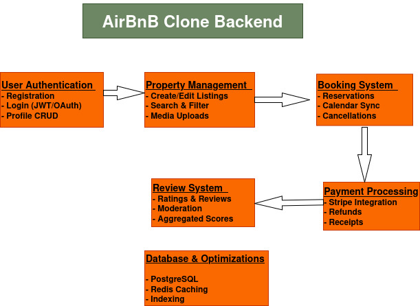

# Airbnb Clone - Backend Features Documentation

## Core Features

### 1. User Authentication
- **Endpoints**:
  - `POST /auth/register/` - User registration
  - `POST /auth/login/` - User login
  - `GET /users/{id}/` - Profile management
- **Features**:
  - JWT token authentication
  - Password encryption
  - Profile picture uploads

### 2. Property Management
- **Endpoints**:
  - `POST /properties/` - Create listing
  - `GET /properties/?search=` - Search listings
  - `PUT /properties/{id}/` - Update listing
- **Features**:
  - Image gallery support
  - Geo-location tagging
  - Amenity filtering

### 3. Booking System
- **Endpoints**:
  - `POST /bookings/` - Create reservation
  - `GET /bookings/{id}/` - Retrieve booking
  - `DELETE /bookings/{id}/` - Cancel booking
- **Features**:
  - Conflict detection
  - Price calculation
  - iCal integration

### 4. Payment Processing
- **Endpoints**:
  - `POST /payments/` - Process payment
  - `POST /payments/refund/` - Initiate refund
- **Features**:
  - Stripe API integration
  - Payment records
  - Receipt generation

### 5. Review System
- **Endpoints**:
  - `POST /reviews/` - Submit review
  - `GET /properties/{id}/reviews/` - Get reviews
- **Features**:
  - 5-star rating system
  - Review moderation
  - Host responses

## Database Schema
- Users table
- Properties table
- Bookings table
- Payments table
- Reviews table

## Technology Stack
- Backend: Django + Django REST Framework
- Database: PostgreSQL
- Cache: Redis
- API: REST + GraphQL

## System Requirements

### Technical Stack
| Component               | Specification           |
|-------------------------|-------------------------|
| Backend Framework       | Django 4.2 + DRF        |
| Database                | PostgreSQL 14+          |
| Authentication          | JWT Tokens              |
| Cache                   | Redis 7.0               |
| Containerization        | Docker 20.10+           |

### Infrastructure
- **Minimum**: 2GB RAM, 10GB Storage
- **OS**: Linux/Windows Server 2019+

## Feature Specifications

### User Authentication

**Functional Requirements**
- ✅ User registration with email verification
- ✅ JWT-based login/logout
- ✅ Password recovery
- ✅ Profile management

