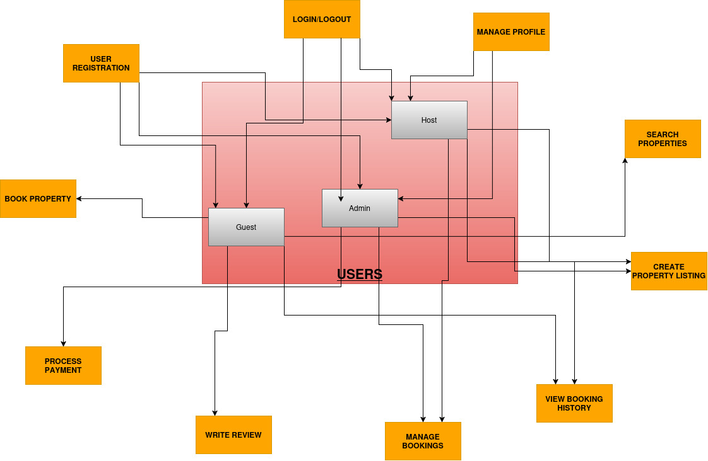

# Airbnb Clone - Use Case Diagram Documentation

## Actors
1. **Guest**
   - Browses and books properties
   - Makes payments
   - Writes reviews

2. **Host**
   - Creates and manages property listings
   - Manages bookings
   - Responds to reviews

3. **Admin**
   - Processes transactions
   - all actions
   - Handles refunds

## Key Use Cases

### 1. User Registration
- **Actor**: Guest/Host
- **Description**: New users create an account
- **Extensions**: Email verification

### 2. Book Property
- **Actor**: Guest
- **Description**: Reserve a property for specific dates
- **Includes**: Process Payment
- **Precondition**: User logged in

### 3. Create Property Listing
- **Actor**: Host
- **Description**: Add new property to the system
- **Extensions**: Upload photos, set pricing

### 4. Process Payment
- **Actor**: System (with Payment System)
- **Description**: Handle payment transaction
- **Variations**: Refund processing

### 5. Write Review
- **Actor**: Guest
- **Description**: Leave rating and feedback
- **Precondition**: Booking completed

## System Boundaries
- **Internal**: All user management and property functions
- **External**: Payment gateway integration
